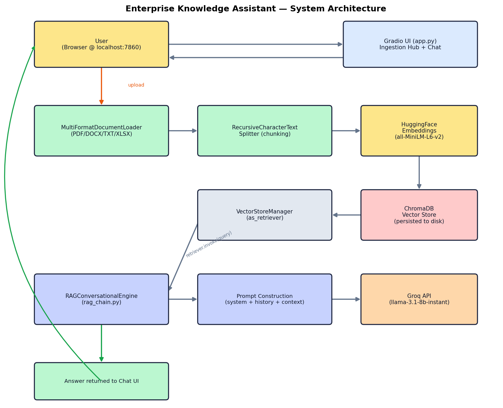
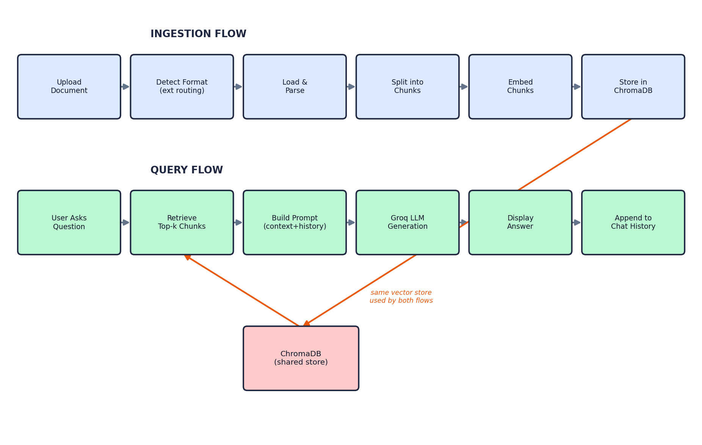
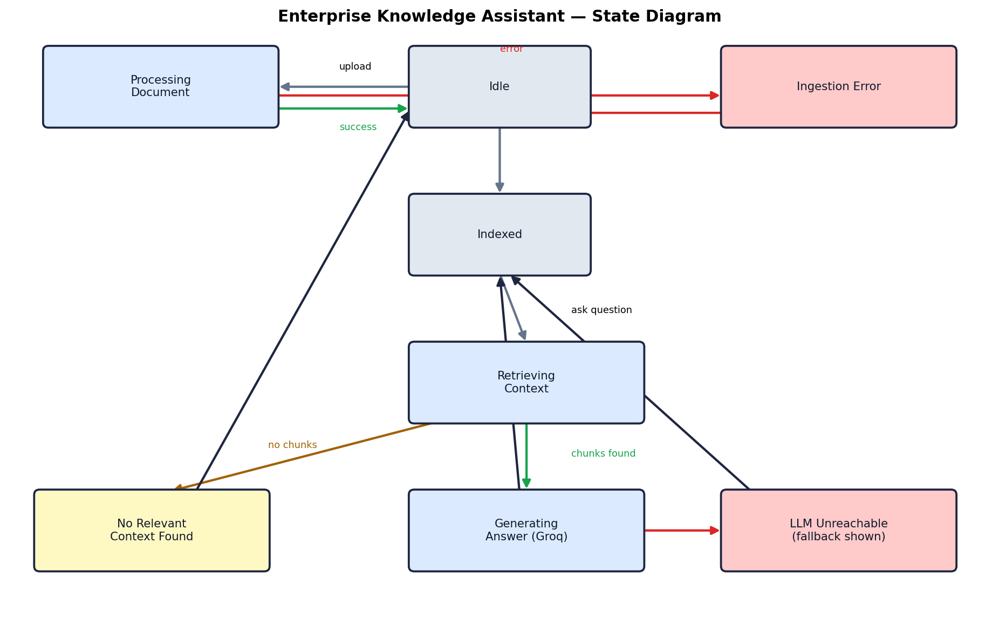

# Enterprise Knowledge Assistant — RAG Chatbot

A Retrieval-Augmented Generation (RAG) chatbot built with LangChain, ChromaDB,
and Groq, supporting PDF, DOCX, TXT, and XLSX document ingestion with a
conversational Gradio interface.

## Project Overview

This project implements a multi-format document Q&A chatbot. Users upload
documents, which are chunked, embedded, and stored in a local ChromaDB vector
database. Questions are answered by retrieving the most relevant chunks and
passing them, along with conversation history, to an LLM for a grounded,
natural-language response.

## Objectives

- Ingest and chunk documents across multiple formats
- Generate embeddings and store them in a persistent vector database
- Retrieve relevant context for a given user query
- Apply prompt engineering to ground LLM answers in retrieved context
- Support multi-turn conversational question answering

## System Architecture



```
┌─────────────┐     ┌──────────────────┐     ┌───────────────┐
│  Document   │────▶│  Document Loader  │────▶│  Text Chunker  │
│ (PDF/DOCX/  │     │ (format routing)  │     │ (Recursive     │
│  TXT/XLSX)  │     └──────────────────┘     │  Splitter)     │
└─────────────┘                              └───────┬────────┘
                                                       │
                                                       ▼
                                          ┌────────────────────────┐
                                          │  HuggingFace Embeddings │
                                          │   (all-MiniLM-L6-v2)    │
                                          └────────────┬────────────┘
                                                       │
                                                       ▼
                                          ┌────────────────────────┐
                                          │   ChromaDB Vector Store │
                                          │  (persisted to disk)    │
                                          └────────────┬────────────┘
                                                       │
                                    User Query ────────┤
                                                       ▼
                                          ┌────────────────────────┐
                                          │   Retriever (top-k)     │
                                          └────────────┬────────────┘
                                                       │
                                                       ▼
                                          ┌────────────────────────┐
                                          │  Prompt Construction    │
                                          │ (system + history +     │
                                          │  context + query)       │
                                          └────────────┬────────────┘
                                                       │
                                                       ▼
                                          ┌────────────────────────┐
                                          │   Groq LLM (generation) │
                                          └────────────┬────────────┘
                                                       │
                                                       ▼
                                          ┌────────────────────────┐
                                          │   Answer + Chat History │
                                          │      (Gradio UI)        │
                                          └────────────────────────┘
```

## Flow Diagram



**Ingestion flow:** Upload → Detect format → Load → Split into chunks → Embed
→ Store in ChromaDB → Confirm success in UI.

**Query flow:** User asks question → Retrieve top-k similar chunks → Build
prompt (system instructions + recent history + retrieved context + question)
→ Call LLM → Return answer → Append turn to chat history.

## State Diagram



```
[Idle] --upload file--> [Processing Document] --success--> [Indexed]
[Indexed] --ask question--> [Retrieving Context]
[Retrieving Context] --context found--> [Generating Answer] --> [Idle]
[Retrieving Context] --no context--> [No Answer] --> [Idle]
[Processing Document] --error--> [Ingestion Error] --> [Idle]
[Generating Answer] --LLM error--> [Fallback: Raw Context Shown] --> [Idle]
```

## Methodology

1. Documents are routed to a format-specific loader based on file extension:
   `PyPDFLoader` (PDF), `TextLoader` (TXT), `UnstructuredWordDocumentLoader`
   (DOCX), and a custom `pandas`-based row-by-row loader (XLSX).
2. Loaded documents are split using `RecursiveCharacterTextSplitter`
   (chunk size 1000, overlap 200).
3. Chunks are embedded using a local HuggingFace sentence-transformer model
   (`all-MiniLM-L6-v2`) — no API key required for embeddings.
4. Embeddings are stored in ChromaDB, persisted to disk so the index survives
   restarts, and accumulate across multiple uploaded documents in the same
   collection.
5. On each question, the top-k most similar chunks are retrieved and
   combined with a system prompt that instructs the LLM to answer only from
   the provided context.
6. The last 5 conversation turns are included in the prompt for multi-turn
   continuity.
7. Groq's hosted LLM (`llama-3.1-8b-instant`) generates the final answer.

## Technology Stack

| Component            | Technology                          |
|-----------------------|--------------------------------------|
| Orchestration          | LangChain                           |
| Vector Database        | ChromaDB                            |
| Embeddings              | HuggingFace `all-MiniLM-L6-v2`      |
| LLM (generation)        | Groq (`llama-3.1-8b-instant`)       |
| UI                       | Gradio                              |
| Document parsing         | pypdf, unstructured, docx2txt, pandas (XLSX) |

## Installation & Execution (PyCharm)

1. Open this folder as a PyCharm project (**File → Open**).
2. When prompted, let PyCharm create a virtual environment, or manually:
   ```bash
   python -m venv .venv
   .venv\Scripts\activate      # Windows
   source .venv/bin/activate   # macOS/Linux
   ```
3. Install dependencies:
   ```bash
   pip install -r requirements.txt
   ```
4. Copy `.env.example` to `.env` and add your free Groq API key
   (get one at https://console.groq.com → API Keys):
   ```
   GROQ_API_KEY=gsk_your_key_here
   ```
5. Run the app:
   ```bash
   python app.py
   ```
6. Open the local URL shown in the terminal (typically `http://127.0.0.1:7860`).
7. Upload a document, click **Process & Index Document**, then ask a question.

## Experimental Results

- Successfully ingested and indexed documents across all four supported
  formats (PDF, DOCX, TXT, XLSX), including multiple documents accumulating
  in the same vector store without overwriting one another.
- Retrieval correctly surfaces relevant chunks for topical, factual
  questions, and correctly declines to answer when no relevant context
  exists (tested against out-of-domain questions).
- Multi-turn conversational memory verified — follow-up questions referring
  back to earlier turns (e.g. "when did that happen?") resolve correctly.
- Generation via Groq returns grounded answers in under ~2 seconds per
  query.

## Challenges and Solutions

| Challenge | Solution |
|---|---|
| Gradio 6 removed the `type` parameter and tuple-format chat history | Switched to the dict-based `{"role": ..., "content": ...}` messages format required by current Gradio versions |
| Vector store object was discarded after creation, so nothing could query it | Refactored `VectorStoreManager` to cache a live `Chroma` instance and expose `as_retriever()` |
| Local LLM inference (TinyLlama) was too slow on an 8GB RAM laptop | Switched generation to Groq's cloud API, which offloads compute and returns responses in ~1 second |
| Hugging Face Inference API token permissions caused repeated 401 errors | Avoided the issue entirely by using Groq instead |
| `unstructured`'s Excel loader flattened whole sheets into one ambiguous chunk, causing the LLM to cross-attribute values between rows (e.g. mixing up which sales rep belonged to which region) | Replaced it with a custom `pandas`-based loader that turns each row into its own explicitly-labeled chunk (`Column: Value \| Column: Value...`) |
| Naive top-k retrieval occasionally missed the specific chunk needed to answer identity-style questions (e.g. "name her?" about an uploaded resume) | Documented as a known limitation of naive RAG; noted as a candidate use case for Graph RAG in the accompanying Research Manual |

## Future Improvements

- Add LangGraph-based multi-step agent workflows (advanced-level task)
- Add source citations in the UI (which document/page an answer came from)
- Support streaming responses token-by-token in the chat UI
- Add automated evaluation of retrieval quality (e.g. Ragas)
- Explore a Graph RAG index for entity-heavy documents to resolve the
  retrieval-recall limitation noted above

## References

- LangChain documentation: https://python.langchain.com
- ChromaDB documentation: https://docs.trychroma.com
- Groq documentation: https://console.groq.com/docs
- Gradio documentation: https://www.gradio.app/docs

## Research Manual

See `docs/Research_Manual.pdf` (or `.docx`) for the accompanying technical
research manual covering Transfer Learning, LLM Fine-Tuning, LoRA, QLoRA,
Quantization, GPU requirements/optimization, and the Fine-Tuning vs. RAG and
Naive RAG vs. Graph RAG comparisons (mandatory Task 3 & 4).

## GitHub Repository

https://github.com/zobiarafiq2005-bot/rag-ai-chatbot